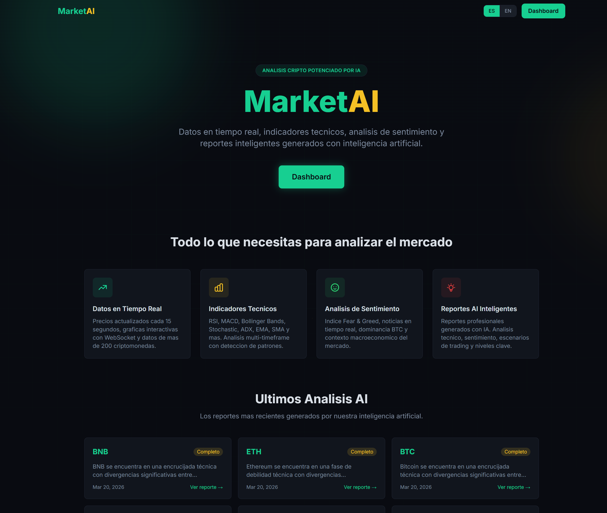

<p align="center">
  
</p>

<h1 align="center">MarketAI</h1>

<p align="center">
  AI-powered cryptocurrency analysis platform — real-time data, technical indicators, sentiment analysis, and intelligent reports generated with artificial intelligence.
</p>

<p align="center">
  
  
  
  
  
  
</p>

---

## Features

- **Real-Time Data** — Prices updated every 15 seconds, interactive candlestick charts with WebSocket streaming, and data for 200+ cryptocurrencies
- **Technical Indicators** — RSI, MACD, Bollinger Bands, Stochastic, ADX, EMA, SMA with multi-timeframe analysis and candlestick pattern detection
- **Sentiment Analysis** — Fear & Greed Index, BTC dominance, news sentiment, global market context, and regulatory/macro keyword filtering
- **AI Reports** — Professional-grade analysis reports generated with Claude AI, covering trading signals, key levels, and market outlook
- **Multi-Timeframe Confluence** — Comprehensive reports combining 4h, 1d, and 1w timeframes with trend alignment and strength scoring
- **Watchlists** — Personalized coin watchlists to track your favorite assets
- **Internationalization** — Full support for English and Spanish (ES/EN)
- **Responsive Design** — Mobile-first UI with sidebar navigation and hamburger drawer

## Tech Stack

| Layer | Technology |
|-------|-----------|
| **Backend** | NestJS 11, TypeScript 5.7, Prisma 7, BullMQ |
| **Frontend** | Angular 21 (standalone components, signals), Tailwind CSS 4 |
| **AI** | Anthropic Claude Sonnet via `@anthropic-ai/sdk` |
| **Database** | PostgreSQL + Prisma ORM |
| **Cache & Sessions** | Redis |
| **Charts** | TradingView lightweight-charts |
| **Data Sources** | CoinGecko, Binance, CryptoCompare, Alternative.me |
| **Deploy** | Docker multi-stage builds, docker-compose |

## Getting Started

### Prerequisites

- Node.js 20+
- pnpm
- PostgreSQL
- Redis

### Environment Variables

Create a `.env` file at the project root from `.env.example`


### Backend

```bash
pnpm install
npx prisma migrate dev
npx prisma generate
npm run start:dev
```

The API will be available at `http://localhost:3001`.

### Frontend

```bash
cd frontend
pnpm install
npx ng serve --proxy-config proxy.conf.json
```

The app will be available at `http://localhost:4201`.

### Docker

```bash
docker compose up --build
```

## API Overview

| Endpoint | Description |
|----------|-------------|
| `POST /api/v1/auth/signin` | User login |
| `POST /api/v1/auth/signup` | User registration |
| `GET /api/v1/crypto/top?limit=200` | Top cryptocurrencies |
| `GET /api/v1/crypto/search?q=` | Search coins |
| `GET /api/v1/crypto/klines/:symbol` | OHLCV candlestick data |
| `GET /api/v1/analysis/:symbol/indicators` | Technical indicators |
| `GET /api/v1/analysis/:symbol/patterns` | Candlestick patterns |
| `GET /api/v1/analysis/:symbol/levels` | Support & resistance levels |
| `GET /api/v1/market-context/:symbol/news` | Crypto news |
| `GET /api/v1/market-context/sentiment` | Market sentiment |
| `POST /api/v1/ai/report/:symbol` | Generate AI report |
| `POST /api/v1/ai/report/:symbol/comprehensive` | Generate comprehensive AI report |
| `GET /api/v1/ai/reports` | List user reports |

## Project Structure

```
src/                          # NestJS backend
├── modules/
│   ├── auth/                 # Authentication & sessions
│   ├── user/                 # User management
│   ├── crypto/               # CoinGecko + Binance integration
│   ├── analysis/             # Technical indicators & patterns
│   ├── market-context/       # News, sentiment, macro context
│   ├── ai/                   # Claude AI report generation
│   └── verifications/        # Email & password reset tokens
└── libs/
    ├── cache/                # Redis cache service
    ├── db/                   # Prisma database service
    └── common/               # Shared utilities

frontend/src/app/             # Angular frontend
├── core/                     # Services, guards, interceptors
├── features/
│   ├── dashboard/            # Top coins table
│   ├── coin-detail/          # Price, chart, indicators, reports
│   ├── ai-reports/           # Reports list & detail viewer
│   └── profile/              # User settings
├── shared/                   # Reusable components & pipes
└── layouts/                  # Dashboard & auth layouts
```

## License

This project is private and unlicensed.
